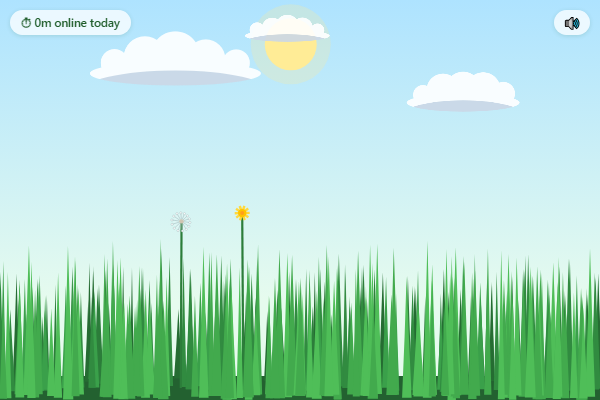

# Grass Toucher 🌱

Finally, a way to touch grass without going outside.

**[Install it from the Chrome Web Store →](https://chromewebstore.google.com/detail/ejhmjbgghkjfhgcffinnmodkcfnlpjja)**

An oddly satisfying pocket lawn that lives in your toolbar. The icon grows
shaggier the longer you browse — open the popup and brush the grass to "mow"
it back to a fresh cut.

## Try it

1. Open `chrome://extensions` in Chrome
2. Turn on **Developer mode** (top right)
3. Click **Load unpacked** and pick this folder
4. Pin Grass Toucher to your toolbar and go touch some grass

## What it does

- **Hover to brush** — blades part around your cursor, bend with your swipe
  velocity, and spring back. Procedural rustle sounds (no audio files).
- **Hold + drag to mow** — blades under the pointer are chopped flat at the
  height you touch: swipe high for a trim, low for a buzz cut. Clippings fly,
  stubs regrow individually.
- **Mow most of the lawn short** and you get the chime + toast, which resets
  the toolbar icon. Can't re-trigger until the lawn grows back.
- **Dandelions spread** — they grow at 2× grass speed: sprout → yellow flower
  → white puff → seeds blow away → wilt. Every puff that seeds spawns 3 new
  plants (capped at 24); mowing one kills it for good, and a cut puff drops
  its seeds harmlessly. Clear them all and a lone seed drifts back in on the
  wind. The population persists, and life keeps ticking at 1/10 speed while
  the popup is closed — neglect has consequences.
- **A sky that knows the time** — the sun tracks your real local clock across
  the sky with dawn/dusk tints; at night the lawn dims under a moon, stars,
  and fireflies. Preview any hour by opening `popup.html?hour=22` in a tab.
- **The living icon** — after 30 / 90 / 180 active minutes without a mow, the
  toolbar grass grows from fresh → long → shaggy → full jungle (with a
  dandelion). Idle time doesn't count.
- **No accounts, no servers** — one local stat (minutes online today), and
  nothing leaves your machine.

## Files

| File | What it is |
|---|---|
| `manifest.json` | MV3 manifest — permissions: `storage`, `alarms`, `idle` |
| `popup/grass.js` | The lawn: blade spring physics, rendering, input, daisies |
| `popup/audio.js` | Procedural Web Audio rustles, mow ding, daisy pop |
| `background.js` | Minute-by-minute time tracking + dynamic toolbar icon |
| `icons/` | Static icons (the worker redraws the toolbar one at runtime) |

## Tuning knobs

- Mow feel: `CUT_RADIUS`, `MOWED_FRAC`, `REGROW` in `popup/grass.js`
- Dandelion pacing: `FLOWER_TIME` / `PUFF_TIME` / `MAX_DANDELIONS` /
  `OFFLINE_SCALE` in `popup/grass.js`
- Daylight hours: `SUNRISE` / `SUNSET` in `popup/grass.js`
- Icon shagginess schedule: `levelFor()` thresholds in `background.js`
- Grass feel: `SPRING` / `DAMP` in `popup/grass.js`

Tip: `popup/popup.html` also runs standalone in a regular browser tab, which
is handy for tuning the feel without reloading the extension.
